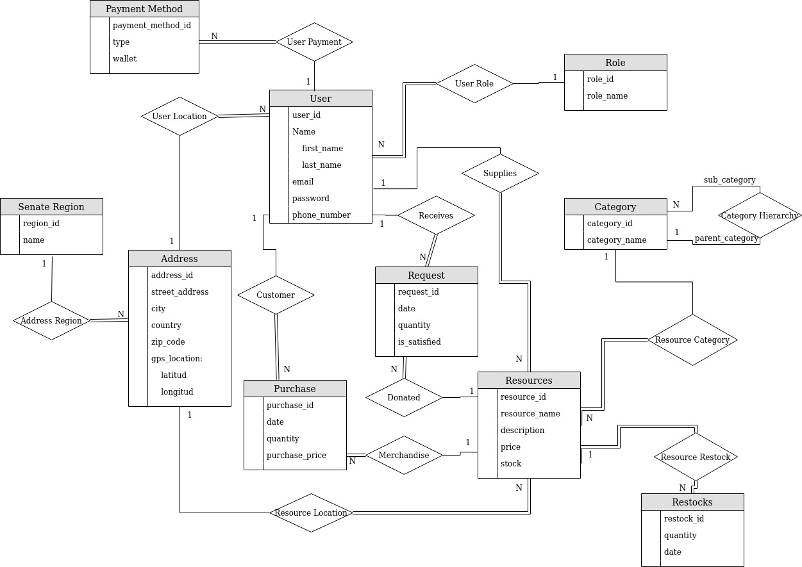

# DB_project

## Group Participants
Eduardo O'Neill 
Fernando Guzman 
Jaime Torrens

## Description
This project is the backend of an application that manages disaster relief supplies for those that need it. 

## Entity Relationship Diagram
Link to diagram: https://drive.google.com/file/d/1-UbNseLd5zJ4iH2_MvqiEngKwrQ9kIPz/view?usp=sharing

### Entities
* User

  A user represents an account that will interact with the application. The user has identifying details and contact information such as name, email, password, and phone number. The user would also hold as foreign keys an address id and role id.
   
* Role

  A role represents the type of account the user has. The current three roles are client, supplier, admin. If a user is a client, the account is authorized to make purchases and requests for supplies. If the user is a supplier, the account can submit resources for sale on the application. Finally, if a user is an admin, they can look at the statistics of the application as a whole, as well as making different changes to the system, such as adding new categories or creating more roles if the need arises.
  
* Address

  An address holds the location details for other entities. The information is composed of the physical address as well as the GPS location in terms of latitude and longitude, and the Senate Region.
  
* Resource

  A resource is an item that a supplier is providing on the platform. These can be any kind of item. The information stored for each resource is its name, description, price and stock. The stock is the amount of that particular resource that the specific user has. If another user is providing a similar item, they have their own entry and inventory. The resource will also hold as foreign keys a supplier id, address id, and category id 
  
* Category

  A category represents the type of resource that is being supplied. Categories have a name so that users can identify. They can also have subcategories, such that if A is a subcategory of B, then a search for items under category B would also include items in A. In the case that a category is a subcategory then it will hold the id of its parent category as a foreign key.

* Restock Entry

  Whenever a supplier wants to add more inventory (increase the stock of an item), the quantity added and the date is recorded as a restock entry. This helps us determine whether there was enough supply for the demand of an item within certain time frames. The information is useful when calculating statistics based on availability. This entity would hold the quantity, date, and the recource id it points to.

### Relationships

* Purchase

  A user can purchase a resource, or many instances of a resource if stock is available. The transaction is stored as a relationship between these two entities. This also applies if the item was given away for free. In this case, it is registered as a purchase of $0.00 and treated as a reservation in the client side.
  
  **Entity participation:** User, Resource
  
  **Relationship Type:** Many to Many. A user can purchase many resources. A resource can be purchased by many users.

* Request

  If an item is not available (no stock), then the item can be requested by the client. The client can request a specific quantity of a resource. A request is not a reservation, it simply represents the demand for an item that is out of stock so that an admin can look at the statistics and see what is needed the most.
  
  **Entity participation:** User, Resource
  
  **Relationship Type:** Many to Many. A user can request many resources. A resource can be requested by many users.

* Supplies

  This relationship is used to represent that a user is the supplier of a resource. 

  **Entity participation:** User, Resource (Total participation on the Resource)
  
  **Relationship Type:** One to Many. A user can supply many resources. A resource can only be supplied by one user. Every resource has a user that supplies it. Not all users supply a resource.
  
* Category Hierarchy

  A category can have a parent category. A category that has no parent category would be considered a root category.
  
  **Entity participation:** Category, Category
  
  **Relationship Type:** One to Many. A category can have many subcategories, but can only have one parent categories. A category may have no parent.
  
* User Location

  This relationship indicated how a user must have an address or location associated with it. Clients can search based on location. Suppliers can use the address to set it for the resource they are supplying.
  
  **Entity participation:** User, Address (Total participation on the User)
  
  **Relationship Type:** One to One. Every user must have an address. An address can only belong to a single user (for the purposes of this project).
  
* Resource Location

  This relationship indicated that a resource is in a location, which is the address. A supplier can use the their location to indicated that the resource is in the same location that they are, but the location of a resource can be submitted completely independent of the supplier, which is helpful in the case for bigger suppliers.
  
  **Entity participation:** Resource, Address (Total participation on the Resource)
  
  **Relationship Type:** One to Many. Every resource must have a single address. Many resources can be located at the same address.
  
* Other

  + User - Role
  
    **Many to One. (Total participation on User)** User must have exactly one role. Many users have the same role. 
    
  + Resource - Category
  
    **Many to One. (Total participation on Resource)** Many resources can have the same category. A resource can only belong to one category
    
  + Resource - Restock Entry
  
    **One to Many. (Total participation on both)** A resource can be restocked many times, thus having many entries. A restock entry is associated with only resource. The initial stock of a resource is its first restock.
